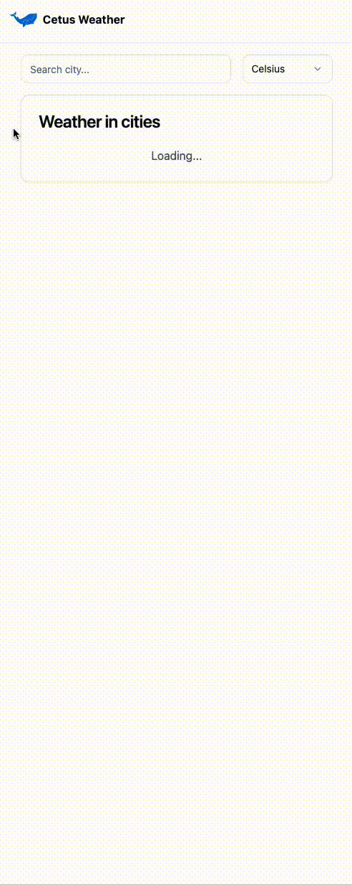

# Coding Assignment: Building Weather City List App with React and TypeScript

## Introduction:

Welcome to the coding assignment for building a Weather City List application using React, TypeScript, and Tailwind CSS. In this assignment, you will be implementing various features to create a user-friendly weather app that allows users to view current weather conditions for different cities, search for cities by name, add cities to favorites, and convert temperature units. The application's UI components are already styled using Tailwind CSS, and your task is to implement the specified functionalities.

## Requirements:

Your task is to implement the following features in the Weather City List application:

1. **API Call and Display:**

   - Make an API call to retrieve a list of cities along with their current weather conditions.
   - The API endpoint to use is `/weather` and it returns data in following structure:

   ```Typescript
    [
      {
         id: "614bd555-f160-56be-96bb-98e821565f92",
         city: "New York",
         temperatureCelsius: 23,
         description: "cloudy",
      },
      {
         id: "4e6063bd-9320-5c97-97f0-4ec18d6b5481",
         city: "Los Angeles",
         temperatureCelsius: 28,
         description: "sunny",
      },
      {
         id: "64390e15-1b13-558a-90dc-2cf916432ccc",
         city: "Chicago",
         temperatureCelsius: 18,
         description: "stormy",
      },
      {
         id: "a6cd9903-9384-54f6-b57c-45588c5bc35c",
         city: "Houston",
         temperatureCelsius: 32,
         description: "sunny",
      },
      {
         id: "203b5fd4-5e56-5707-ab4f-b505277927f2",
         city: "Miami",
         temperatureCelsius: 30,
         description: "sunny",
      },
      {
         id: "21331e9e-3a32-5bb8-8e12-0ec9f269faa4",
         city: "Toronto",
         temperatureCelsius: 20,
         description: "cloudy",
      },
      {
         id: "722c522d-2ad0-535c-8deb-f3dc71acecae",
         city: "Vancouver",
         temperatureCelsius: 15,
         description: "stormy",
      },
   ]
   ```

   - Display the list of cities and their weather information on the screen.
   - Each city item should display relevant weather data, such as temperature, weather description and related icon.
   - The weather icon should be displayed using the `react-icons` library, they are already imported in `WeatherIcon.tsx` component for convenience.

2. **Search Functionality:**

   - Implement a search input field that allows users to filter cities by their names.
   - Filtering should be done on the client-side without making additional API calls.
   - As the user types in the search input, update the list of displayed cities accordingly.

3. **Favorites Feature:**

   - Provide a way for users to add cities to their favorites list by clicking the heart icon button next to displayed temperature.
   - Display a separate section to showcase the user's favorite cities.
   - Users should be able to add and remove cities from the favorites list.

4. **Temperature Unit Conversion:**
   - Implement a select input to allow users to switch between Celsius and Fahrenheit temperature units.
   - Convert and display the temperature values in the selected unit throughout the application.
   - Use following formula for calculating Fahrenheit temperature from Celsius:
   ```
   fahrenheit = (celsius * 9) / 5 + 32;
   ```

## Application demo



## Instructions:

1. Clone this repository to your local development environment.
2. Navigate to the project directory and install the required dependencies using `npm install`. Run the development server using `npm run dev`.
3. Familiarize yourself with the existing codebase, including the UI components styled with Tailwind CSS.
4. In the `src` directory, locate the relevant components and files where you need to implement the specified functionalities.
5. Make use of React hooks and state management to handle user interactions and data.
6. Use TypeScript for type-safe programming and ensure type annotations are consistent and accurate.
7. Make use of appropriate API endpoints and libraries for making API calls (e.g., `fetch` or a suitable library).
8. You are allowed to modify the existing codebase and folder structure if necessary.
9. When you finish the assignment, push your code to a new public repository on your github account.

**Evaluation Criteria:**
Your assignment will be evaluated based on the following criteria:

- Correct implementation of specified features.
- Proper handling of API calls, data management, and state updates.
- Clean and organized code structure.
- Effective use of TypeScript for type safety.
- Adherence to best practices for React development.
- User interface responsiveness and usability.
- Thoughtfulness in design decisions and overall user experience.

We look forward to seeing your implementation of the Weather City List application! If you have any questions or need clarifications, please don't hesitate to reach out to us. Happy coding!
